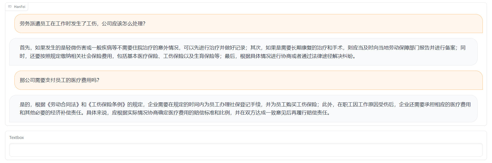
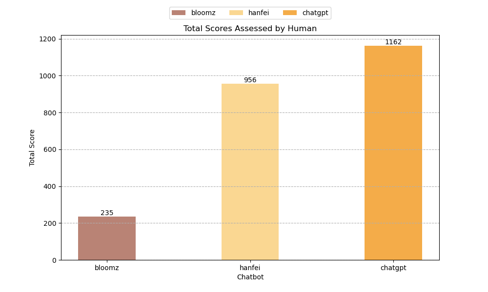

# HanFei
## 介绍
HanFei-1.0(韩非)是国内首个**全参数**训练的法律大模型，参数量7b，主要功能包括：法律问答、多轮对话、撰写文章、检索（敬请期待）等。

[beta版本](http://siat.yang42.com:10185/)

例子1



例子2


## 数据
`注：目前只开源hanfei-1.0微调数据，不开源预训练数据。`

### 数据处理

src/data_processing/gen_pretrain_data.py    生成预训练数据

src/data_processing/gen_instruction_multi.py    生成指令数据、合并微调数据

### 预训练数据

数据组成：案例、法规、起诉状、法律新闻等。

数据量：约60G数据，每条2048个token。

### 微调数据

#### hanfei 1.0
第一版使用规则筛选

| 数据类型             | 文件名称                    |  数据量 | 
| :------------------- | :-------------------------  |  :----- | 
| 中文通用指令         |zh_general_instruction.json  |   5.3w  |
| 中文法律指令         | zh_law_instruction.json     |  4.1w   |     
| 中文通用对话         |zh_general_conversation.json | 5.5w    |    
| 中文法律对话         | zh_law_conversation.json    | 5.6w    |  
| 中文法律问答数据     | zh_law_qa.json              | 5w      | 


#### 数据、模型下载链接
百度网盘：

链接：https://pan.baidu.com/s/1PkRXUo9sNRQmoXHcW7Aeeg?pwd=d6t5 

提取码：d6t5 

#### hanfei 2.0（开发中）
第二版使用人工筛选


### 模型评估数据

| 数据类型 | 数据路径           | 数据说明                | 数据量                | 
| :------- | :----------------- | :---------------------- | :-------------------- | 
| 法律问题 | data/evaluation_dataset | 包含劳动、婚姻等9个板块 | 150条   | 


## 评估指标
本次采用人工评估的方法，针对每一个法律咨询问题，Hanfei、BLOOMz、ChatGPT 3 个语言模型分别生成回答，我们聘请了专业的律师，为各个语言模型生成的回答打分。

+ 评估指标 1：（0-10 分）0 分最差，10分最好

    本次总共评估了150个问题，我们将每个模型的得分求和，用总得分衡量模型回答的质量，评估结果如下图所示：

    

## 训练

### 环境要求

A100/A800 * 8

### 训练命令
```sh
# Step 1：法律领域预训练
sh scripts/pre_training/run_train.sh

# Step 2: 指令微调
sh scripts/instruction_tuning/run_train.sh

```
## 部署

### 环境要求

40G显存，只需1张A100/A800 或者 2张TITAN RTX...

### 部署命令

```sh
# Gradio 界面
python src/web/hanfei_app.py

# RESTful api
python src/serve/hanfei_serve.py
```

## 项目参与者
本项目由来自于中科院深圳先进院得理法律人工智能联合实验室的何万伟、温嘉宝、张磊、程浩、秦博文、李云水、李之健，深圳市大数据研究院、港中文深圳的蒋峰、陈俊颖同学合作开发，指导教师为深圳市大数据研究院、港中文深圳的**王本友**助理教授和中科院深圳先进院的**杨敏**副研究员。

## 免责声明
本项目相关资源仅供学术研究之用，严禁用于商业用途。使用涉及第三方代码的部分时，请严格遵循相应的开源协议。模型生成的内容受模型计算、随机性和量化精度损失等因素影响，本项目无法对其准确性作出保证，本项目不承担任何法律责任，亦不对因使用相关资源和输出结果而可能产生的任何损失承担责任。

## 致谢

本项目参考了以下开源项目，在此对相关项目和研究开发人员表示感谢。

Bloom: https://huggingface.co/bigscience/bloom

Facebook LLaMA: https://github.com/facebookresearch/llama

Stanford Alpaca: https://github.com/tatsu-lab/stanford_alpaca

Self-instruct: https://github.com/yizhongw/self-instruct

## 引用

```
@misc{HanFei,
  author={Wanwei He and Jiabao Wen and Lei Zhang and Hao Cheng and Bowen Qin and Yunshui Li and Feng Jiang and Junying Chen and Benyou Wang and Min Yang},
  title={HanFei-1.0},
  year={2023},
  publisher={GitHub},
  journal={GitHub repository},
  howpublished={\url{https://github.com/siat-nlp/HanFei}},
}
```

